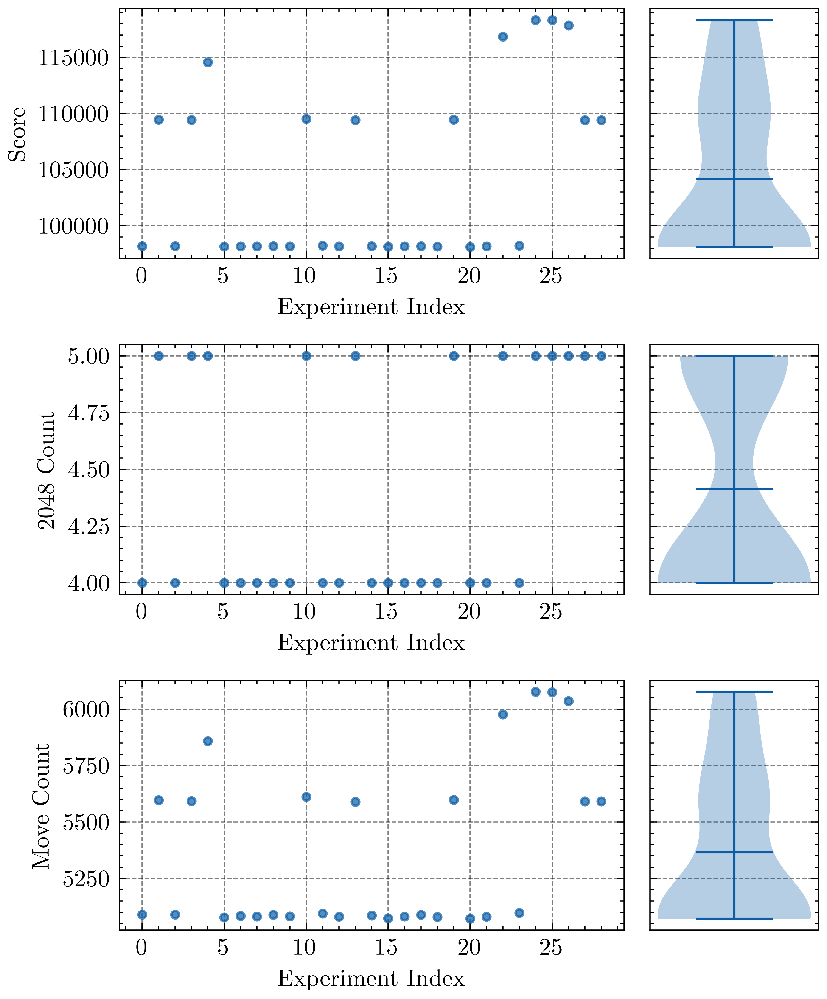
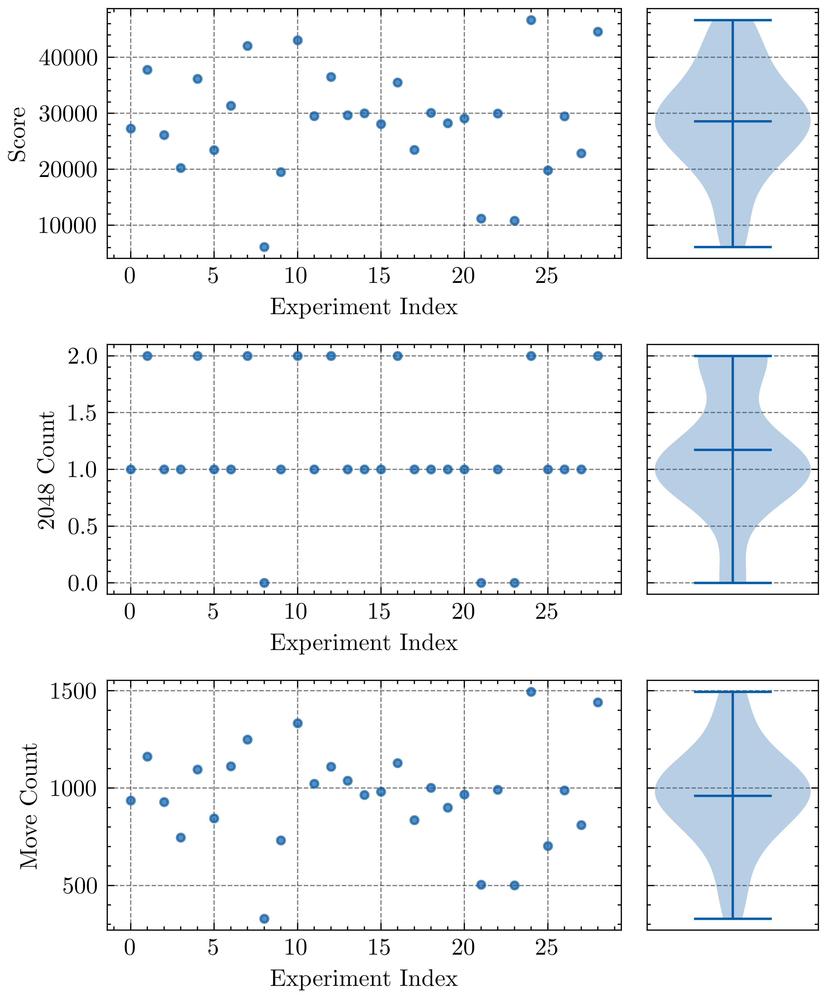
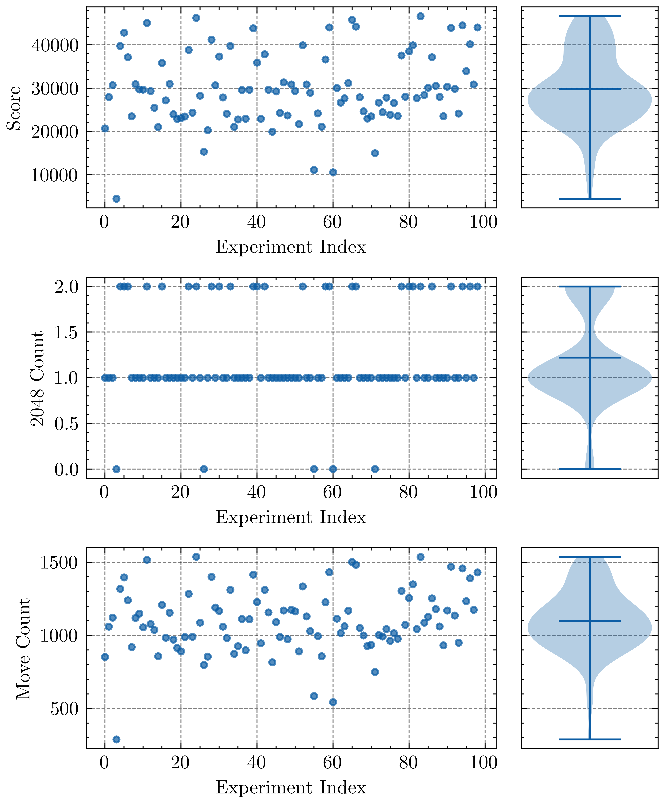

# 更难的2048

本项目基于经典的 [2048 游戏的优化算法](https://github.com/nneonneo/2048-ai?tab=readme-ov-file) 进行了两个关键改动，使其更加具有挑战性：
1. **限制合成上限**：在原版 2048 中，数值可以不断合成至 4096、8192 等更高阶数值。而在本版本中，2048 之后的合成被禁用，玩家需要在更有限的空间内进行策略性操作。
2. **新增大数生成概率**：除经典的 2 和 4 之外，新增了 8、16、32 这类较大数值的生成概率，使游戏的随机性更强，进一步提升了难度。

此外，我们还进行了多次重复性测试，以评估新规则对游戏策略的影响，并测试了代码在不同硬件环境下的计算性能。

---

## 基准能力
 

本实验首先对改进版 2048 游戏的 AI 进行了 \( n = 30 \) 次重复测试，以评估其优化能力，主要分析最终得分、合成 2048 的次数以及移动步数的分布情况。当无大于4的块被随机生成时，算法有100%的概率合成4个2048，最终得分均在90000以上。



显然，引入更大块（如有12%的几率生成 8，4%的几率生成16，4%的几率生成32）的随机生成会增加游戏难度。当游戏内块的生成概率与算法一致时，进行30次测试。结果如上图。有90%的概率合成一次2048。



当游戏内的数字生成概率与算法不匹配时，同样能保证优化结果。

## 构建指南

### Unix/Linux/macOS

在终端中执行以下命令：

```sh
./configure
make
```

本程序适用于任何较新的 C++ 编译器，并且无需执行 `make install`，程序可以直接在当前目录运行。

### Windows

如果你使用 Windows，可以选择以下方式进行编译：

- **纯 Cygwin**：按照 Unix/Linux/macOS 的方式编译，生成的 DLL 仅能用于 Cygwin 环境。如果你希望控制浏览器版本，则需使用 Cygwin Python（而非 python.org 的 Python）。详细的 Cygwin 安装指南请参考[文档](https://github.com/nneonneo/2048-ai/wiki/CygwinStepByStep.pdf)。
- **Cygwin + MinGW**：在 MinGW 或 Cygwin shell 中运行以下命令：

    ```sh
    CXX=x86_64-w64-mingw32-g++ CXXFLAGS='-static-libstdc++ -static-libgcc -D_WINDLL -D_GNU_SOURCE=1' ./configure ; make
    ```

    这样生成的 DLL 可用于非 Cygwin 程序。
- **Visual Studio**：打开 Visual Studio 命令行工具，`cd` 到 `2048-ai` 目录，运行 `make-msvc.bat`。

---

## 运行命令行版本

直接运行：

```sh
bin/2048
```

即可看到 AI 在终端中的运行情况。

---

## 交互式使用 AI

你可以在终端中使用 `2048_ai.py` 的交互模式，让 AI 分析局势并给出最佳操作建议。


1. **准备棋盘数据：**
   你需要提供一个包含 16 个整数的平面列表（0-16），代表当前棋盘的状态。棋盘中的每个数字表示相应位置上的方块（例如：2, 4, 8, 16）。

2. **运行脚本：**
   使用命令行来执行脚本并传入棋盘数据：

   ```bash
   python 2048_ai.py -b 2 4 8 16 2 4 8 16 2 4 8 16 2 4 8 16
   ```
3. **获得输出**
```
   Current board:
         1        2        3        4 
         1        2        3        4 
         1        2        3        4 
         1        2        3        4 
   -------------------
         2        4        8       16 
         2        4        8       16 
         2        4        8       16 
         2        4        8       16 
   Move 2: result 0.000000: eval'd 0 moves (0 cache hits, 0 cache size) in 0.00 seconds (maxdepth=0)
   Move 3: result 0.000000: eval'd 0 moves (0 cache hits, 0 cache size) in 0.00 seconds (maxdepth=0)
   Move 0: result 1587835.125000: eval'd 522880 moves (37187 cache hits, 5544 cache size) in 0.00 seconds (maxdepth=5)
   Move 1: result 1587790.250000: eval'd 517976 moves (36982 cache hits, 5563 cache size) in 0.00 seconds (maxdepth=5)
   0
```
---

## 未来改进方向
- **优化 AI 评估函数**：当前 AI 主要基于空格数量、数值分布进行评估，可进一步优化权重参数。
- **强化学习训练 AI**：可以引入强化学习，让 AI 通过自我对弈进行训练，优化决策策略。
- **适配移动端版本**：目前 AI 主要支持桌面环境，可考虑开发移动端应用。

---

## 结论
本项目对 2048 游戏进行了两项关键改进，使其更加具有挑战性。同时，AI 依然能够以高效的计算性能适应新的规则，并提供较高水平的游戏策略建议。未来，我们计划继续优化 AI 逻辑，使其更智能、更适应不同版本的 2048 游戏。